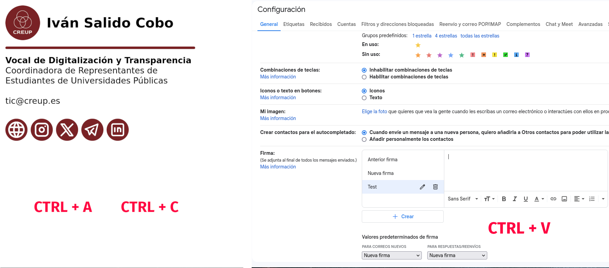
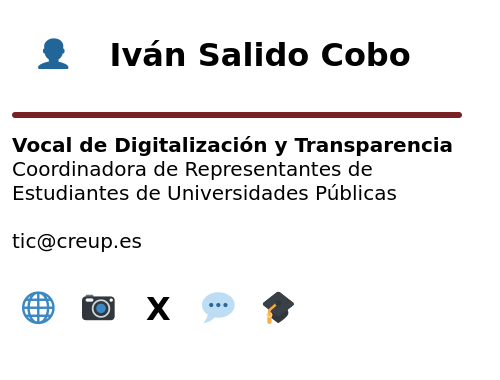

# Firmas para CREUP

Aquí se encuentran las firmas para los correos de los distintos cargos de la Coordinadora de Representantes de Estudiantes de Universidades Públicas (CREUP).

## Lista de firmas

Esta es la lista del archivo correspondiente a la firma de cada cargo:

| Cargo                                                    | Archivo         |
| -------------------------------------------------------- | --------------- |
| Presidente                                               | Presidente.html |
| Secretario                                               | Secretario.html |
| Tesorera                                                 | Tesorera.html   |
| Vicepresidente de Relaciones Institucionales y Proyectos | VPRI.html       |
| Vicepresidente de Política Universitaria                 | VPPU.html       |
| Vicepresidenta de Organización                           | VPO.html        |
| Directora de Comunicación                                | DIRCOM.html     |
| Vocal de Relaciones Internacionales                      | VRI.html        |
| Vocal de Igualdad y Cooperación al Desarrollo            | VICD.html       |
| Vocal de Desarrollo Normativo                            | VDN.html        |
| Vocal de Digitalización y Transparencia                  | VDT.html        |
| Vocal de Asuntos Económicos                              | VAE.html        |
| Vocal de Proyectos                                       | VP.html         |
| Vocal de Formación                                       | VF.html         |
| Vocal de Logística y Contacto con los Miembros           | VLCM.html       |
| Vocal de Política Universitaria                          | VPU.html        |
| Vocal de Vida Universitaria                              | VVU.html        |
| Vocal de Garantía de la Calidad                          | VGC.html        |
| Vocal de Diseño de Contenido                             | VDC.html        |
| Vocal de Redes Sociales                                  | VRS.html        |
| Coordinador del Comité de Garantías                      | CG.html         |
| Secretario del Comité de Garantías                       | SG.html         |
| Coordinador del Comité de Asuntos Internacionales        | CCAI.html       |
| Coordinador del Comité de Asuntos Sectoriales            | CCAS.html       |
| Secretaria del Comité de Asuntos Sectoriales             | SCAS.html       |

## ¿Cómo usar las firmas?

> [!IMPORTANT]
> Estas instrucciones se revisaron por última vez el 6 de julio de 2024, es posible que ya no sirvan.

Lo primero es descargar el archivo correspondiente a la firma que se quiere usar.

### En Gmail

Primero hay que abrir en el navegador el archivo HTML de la firma, seleccionarlo todo con <kbd>Ctrl</kbd> + <kbd>A</kbd> y copiarlo con <kbd>Ctrl</kbd> + <kbd>C</kbd>.

En otra ventana con Gmail, hay que irse a los ajustes, ver todos los ajustes y, en la pestaña «General», al apartado de «Firma». Se crea una firma nueva y, en el campo de texto, se pega la firma con <kbd>Ctrl</kbd> + <kbd>V</kbd>.

No olvidar tampoco cambiar los «Valores predeterminados de firma» a la firma recién creada para que aparezca y guardar los cambios con el botón del final de la página.

### En Thunderbird

Simplemente hay que irse a la configuración de la cuenta, marcar la casilla de utilizar un archivo como firma y seleccionar el archivo de firma descargado:

## Ejemplo de visualización

A continuación hay unas capturas de cómo se deberían de ver las firmas.

Cuando los iconos cargan, la firma se debería de ver así:

Y cuando no cargan, así:

