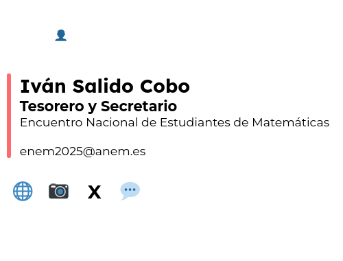

# Firmas para el XXVI ENEM

Aquí se encuentran las firmas para los correos de los distintos cargos de la organización del XXVI Encuentro Nacional de Estudiantes de Matemáticas (ENEM).

## Lista de firmas

Esta es la lista del archivo correspondiente a la firma de cada cargo:

| Cargo                                                                     | Archivo                |
|------------------------------------------------------------------------------|-----------------------|
| Presidente                                                                    | Firma Presidente.html |
| Tesorero y Secretario                                                         | Firma TyS.html        |
| Director Técnico y Digital                                                    | Firma Técnico.html    |
| Directora de Actividades                                                      | Firma Actividades.html|
| Directora de Diseño y Difusión                                                | Firma Diseño.html     |
| Gestor de Apoyo a la búsqueda de financiación                                 | Firma Financiación.html|
| Gestor de Apoyo logístico a los viajes y el transporte                        | Firma Transporte.html |
| Gestor de Apoyo logístico al alojamiento y la manutención                     | Firma Alojamiento.html|
| Gestor de Apoyo logístico al contacto con los ponentes                        | Firma Ponentes.html   |
| Gestora de Apoyo a la difusión, el diseño y las redes sociales                 | Firma RRSS Julia.html |
| Gestora de Apoyo a la difusión, el diseño y las redes sociales                 | Firma RRSS María.html |
| Gestor de Apoyo al desarrollo de la web y la aplicación                       | Firma Web.html        |

## ¿Cómo usar las firmas?

> [!IMPORTANT]
> Estas instrucciones se revisaron por última vez el 29 de octubre de 2024, es posible que ya no sirvan.

Lo primero es descargar el archivo correspondiente a la firma que se quiere usar.

### En Thunderbird

Simplemente hay que irse a la configuración de la cuenta, marcar la casilla de utilizar un archivo como firma y seleccionar el archivo de firma descargado:

### En Gmail

Primero hay que abrir en el navegador el archivo HTML de la firma, seleccionarlo todo con <kbd>Ctrl</kbd> + <kbd>A</kbd> y copiarlo con <kbd>Ctrl</kbd> + <kbd>C</kbd>.

En otra ventana con Gmail, hay que irse a los ajustes, ver todos los ajustes y, en la pestaña «General», al apartado de «Firma». Se crea una firma nueva y, en el campo de texto, se pega la firma con <kbd>Ctrl</kbd> + <kbd>V</kbd>.

No olvidar tampoco cambiar los «Valores predeterminados de firma» a la firma recién creada para que aparezca y guardar los cambios con el botón del final de la página.

## Ejemplo de visualización

A continuación hay unas capturas de cómo se deberían de ver las firmas.

Cuando los iconos cargan, la firma se debería de ver así:

Y cuando no cargan, así:

